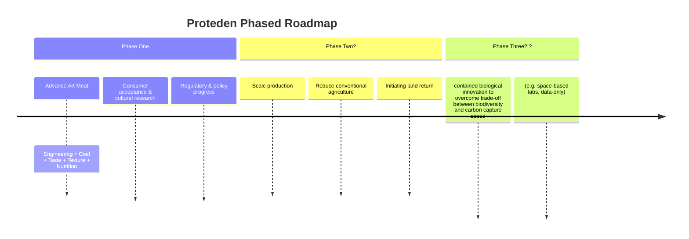

# Proteden

**Protein × Eden**

This is an open, personal effort to urgently accelerate the development and adoption of **Art Meat** — real meat grown directly from animal cells.

The idea isn't new. Nearly 100 years ago, Winston Churchill already pointed out the absurdity of raising entire animals just to eat specific parts. Yet progress in the field remains frustratingly slow — stuck on engineering, cost, and public acceptance. Solving this would free enormous amounts of land for biodiverse restoration and carbon sequestration, while ending a huge amount of unnecessary animal suffering.

Plant-based alternatives are getting better, and that's great. But I'm skeptical we'll convince enough people worldwide to fully give up real meat. That's why I'm betting on Art Meat instead.

This is **not** about bans or top-down control. It's about building clearly superior alternatives that make the transition voluntary and attractive over decades — while opening space for new culinary creativity and culture.

## Why try anyway?

It probably won't work. But it's cheap enough to try, and *not* trying is already a choice in favor of continued suffering. 

I'm approaching this with deliberate naivety, tolerance for cringe when exploring weird ideas, and a strong preference for keeping everything radically open and collaborative.

## Core Principles

- **urgency without panic**
- radical openness
    - public, GitHub-first, and collaborative
- humility and biosafety first
    - bold ideas & careful execution
- We strongly support plant-based alternatives:
    - cheering them on 
    - being open to the possibility that they prove sufficient for our core goals
    - even then: artisan nature of engineered meat might be worthwile in itself.
 
A general meta-level mantra, if you will:
*We dance between vision and evidence. 
**Vision** gives direction; 
**data** and humility provide the beat. 
**Iteration** is the rhythm.*

## Roadmap

## Major Challenges

Bioreactor scalability and cost | Achieving great taste and texture at scale | Deep cultural resistance | Supporting farmers during transition | Biosafety risks | Funding and talent

Contributions attacking any of these are very welcome. Sharp criticism too.

## Want to get involved?

Open an issue, drop ideas, criticize, or just watch. This is early days of a long project. Iterations explicitly invited.
