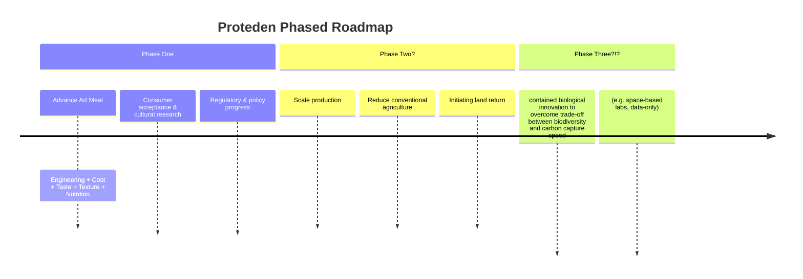

# Proteden

**Protein × Eden** *(get it?)*

An open effort to urgently accelerate the development and adoption of **Art Meat**1 — real meat grown directly from animal cells.

The idea [isn't new](https://en.wikipedia.org/wiki/Cultured_meat#History). Nearly 100 years ago, Winston Churchill famously pointed out the 
> absurdity of growing a whole chicken to eat the breast or wing

and argued the saner alternative of

> growing these parts separately under a suitable medium.

Yet progress in the field got frustratingly stuck on the trifecta 

ENGINEERING 🛠️ | ECONOMICS 📈 | ACCEPTANCE 👎

Solving these would free **enormous** amounts of land for biodiverse restoration and carbon sequestration, while ending a **huge amount** of unnecessary animal suffering. And as a side effect: It will open space for new culinary creativity and culture and experiences we cannot yet begin to imagine and new classes of a creative industry and ... 2

So I say: It is worth a shot to try unsticking ourselves. I can offer naivety. ...and the willingness to fail and pay with cringe.

## Why try anyway?

 But it's cheap enough to try, and *not* trying is already a choice in favor of continued suffering. 

## Core Principles

- **urgency without panic**
- awareness that traditional animal agriculture, animal welfare and scalability are largely anti-correlated by design - necessitating efforts such as Proteden.
- radical collaborativeness
- humility
    - biosafety first
    - it probably won't work. Heck, there is not even a plan yet except "apply naivity" and "iterate"
    - even if real-world things will change: it'll take decades
    - strong support and cheering-on for plant-based alternatives
- at the same time: don't be too shy. openness always in discussing bold, unconventional ideas (since remember: we are stuck). **we err on the side of naivity and optimism.**
- No bans. No unnecessary top-down control.
    - Instead: building towards objectively superior alternatives
    - keeping the transition voluntary and attractive

## Roadmap

## Major Challenges

Bioreactor scalability and cost | Achieving great taste and texture at scale | Deep cultural resistance | Supporting farmers during transition | Biosafety risks | Funding and talent

Contributions attacking any of these are very welcome. Sharp criticism too.

## Want to get involved?

Open an issue, drop ideas, criticize, or just watch. This is early days of a long project. Iterations explicitly invited.

A general meta-level mantra, if you will:  
*We dance between vision and evidence.  
**Vision** gives direction.  
**Data** and humility provide the beat.  
**Iteration** is the rhythm.*

---

1 AFAIK, this name is not established. Yet. What seems established is "Cultured Meat" - this label works great, on multiple levels! _However_, crucially, not on the "roll-off-your-tongue"-ness. Enter "Art Meat": this also includes a hint that the aspired engineering freedom will certainly open up culinary experiences we can not even dream of yet.

2 Plant-based alternatives are getting better, and that's great. But I remain slightly skeptical we'll convince enough people worldwide to fully give up what is objectively real meat. That's why I'm betting on Art Meat instead. And even if it turns out that going plant-based is a sufficient (and much simpler) solution to the stated problems: artisan nature of engineered meat might be worthwile in itself. Better to have it and not need it than vice versa! 🙂
